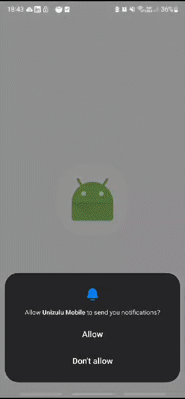

# Unizulu Mobile: Your Personal Campus Companion

## Overview
Unizulu Mobile is an Android application designed to transform the university experience for students of the University of Zululand. 

This app provides a portal to essential campus information and tools such as Campus Directory, Timetable, Fees/Marks, Maps, Library features.

Developed using Java and AndroidStudio, Unizulu Mobile aims to streamline student life by placing important resources right at your fingertips.

## Demo

|        |  |
| :-----------------------------------------: | :-------------------------------: |

## Features

* **Directory:** A comprehensive directory of important campus locations highlighted on a custom Google Maps depiction of the campus.
* **Timetable:** Quick access to the University Timetable for all modules.
* **Fees/Marks:** Portal to view your fee balance and academic marks.
* **Maps:** A bird's eye view of the campus helps you navigate with ease.
* **Library:** Access to the library's database for your research and academic needs.
* **Info:** Access to important campus information including updates, events and news.

## Installation on Android Device

To manually install the APK on your Android device, follow these steps:

1. Go to the 'assets' folder of the project, find the '/assets' directory where the APK file is located.

2. Download the APK file to your device. You can use a service like Google Drive or directly connect your device to your computer and copy the file.

3. Before installing, make sure that your device settings allow app installation from Unknown Sources.

4. Navigate to the location of the APK file on your device and tap on it. You should then see an option to install the app.

## Author/Contact

Shalen Naidoo - View my Other Projects on [shalen-dev.tantum.co.za](https://shalen-dev.tantum.co.za)

## Contributing

We welcome contributions to Unizulu Mobile! If you would like to contribute, feel free to fork the repository, make your changes and then submit a pull request. We will review it as soon as possible.

## License

This project is licensed under the MIT License - see the [LICENSE](LICENSE) file for details